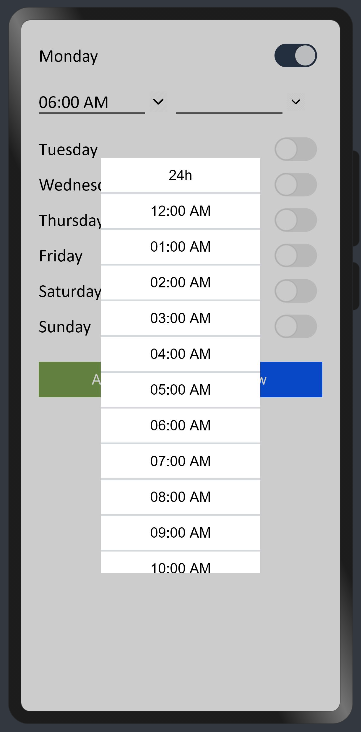

# Business Hour Picker
****
Business hour picker helps you to pick day and time corresponding to a set of working days and show them separately.  
## Dependencies
****
For using bhlib in your app, add the below dependency in the entry/package.json  
```
"dependencies": {
    "@ohos/bhlib": "file:../bhlib"
  }
```
## Usage instructions
****
Import all components at once
```
import { Business,BusinessPicker, Viewer }  from '@ohos/bhlib'
```
## Screenshots
****
 
 

## How to use it
***
### Imports
Import the following
```
import {Business, BusinessPicker ,BusinessHoursWeekView} from '@ohos/bhlib'
```
### Code
To pickup from the days of the week, pass the variable of type business
```
BusinessPicker({
            selectedBusinessModel: $[YourModelName],
            bhTextColor: 'textColor',
            bhTextSize: textSize,
            bhTextStyle: 'font',
            bhFormat : (format 12 or 24)
            bhTodayColor: 'todayColor'
          })
```
To display full list of business days
```
BusinessHoursWeekView({
        showBusinessModel: this.[YourModelName],
        bhIcon: $r(resource),
        bhIconPadding: padding,
        bhTextColor: 'textColor',
        bhTextSize: textSize,
        bhTextStyle: 'font',
        bhTodayColor: 'todayColor',
        bhTodayStyle: 'todayFont',
        bhTodayTextSize: todayTextSize,
        bhTodayIcon: $r(resource)
      })
```
## Styling
****
You can style the viewer  using theses attributes :

| Attribute  | Description  |
| ------------ | ------------ |
| bhIcon  | Left icon of the day  |
|bhTextColor   |  Text color |
| bhTextSize  | Text Size  |
| bhIconPadding  | Left icon padding  |
|  bhTextStyle | Default text style   |
|  bhTodayStyle | Today  text style (highlighted)   |
|  bhTodayTextSize | Today  text size|
| bhTodayIcon | Today left icon|
| bhFormat |12 or 24 hours format|
## Compatibility
****
Supports OpenHarmony API version 8
## Code Contribution
****
If you find any problems during usage, you can submit an [issue](https://github.com/satvikshubham/BusinessHoursPicker/issues/new/choose) to us. Of course, we also welcome you to send us PR.
## Open source License
****
This project is based on Apache License 2.0, please enjoy and participate in open source freely.

